## 部落格Project介绍 :

<p align=center>
   以前端Vue + 後端Springboot 開發的前後端分離個人部落格專案
</p>

<p align="center">
   <a target="_blank" href="https://github.com/X1192176811/blog">
      
      
      
      
      
      
      
      
   </a>
</p>

## 專案亮點總結 :

- 前後端分離, 透過 Docker Compose 部署
- 採用 RESTful 風格設計 API, 搭配 Swagger 提供詳細註解
- 自定義統一的響應格式 ResponseResult
- 完善的權限管理系統, 基於 RBAC 模型
- 集成 Markdown 編輯器與 EasyExcel 導出功能

## 專案特點 :

### 整體 : 
- 前後端分離, 透過 Docker Compose 部署
- 採用 RESTful 風格設計 API, Swagger 註解清楚
- 自定義統一的響應格式 ResponseResult
  - 將 HTTP 狀態碼、錯誤描述和業務回傳資料統一封裝在一個 ResponseResult 對象中
  - 可以提高 API 響應的可讀性和一致性, 同時也便於例外處理與對接前端
- 確實封裝 DTO、VO
- 引入 Validation 參數驗證框架
- 使用 MinIO 雲端物件儲存服務, 處理文章縮圖與使用者大頭貼

### 前台 :
- 熱門文章區塊呈現
<br><br>
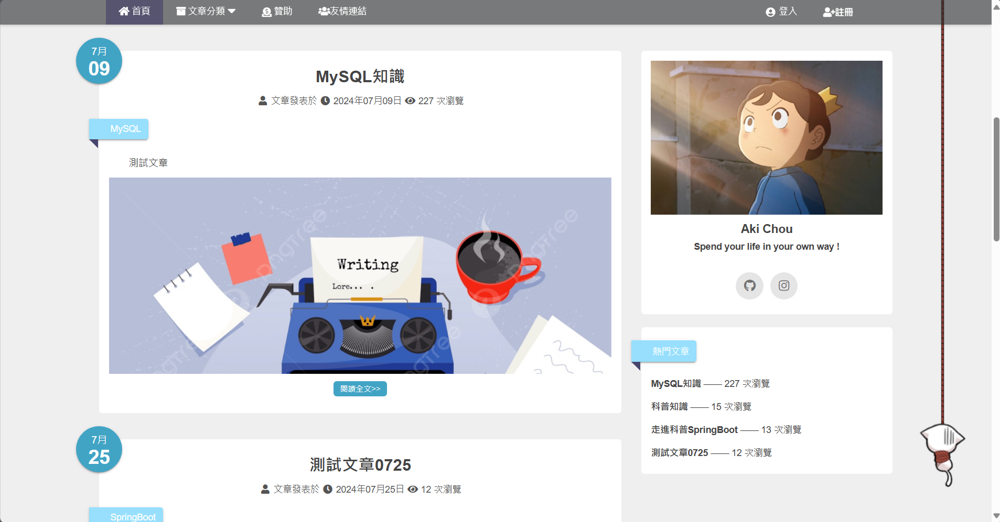<br><br>
- 對文章可發布留言、回覆留言、使用留言表情圖案
  <br><br>
  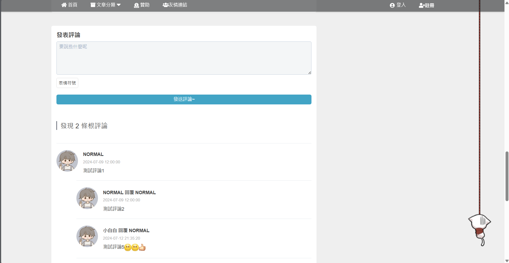<br><br>
- 友情連結 ( 交換連結 ) 之展示
  <br><br>
  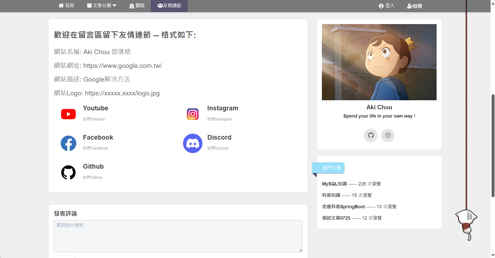<br><br>
- 回到網頁頂端按鈕
  <br><br>
  <br><br>
- 帳號註冊、登入、三階段個人資料驗證之密碼重設功能
  <br><br>
  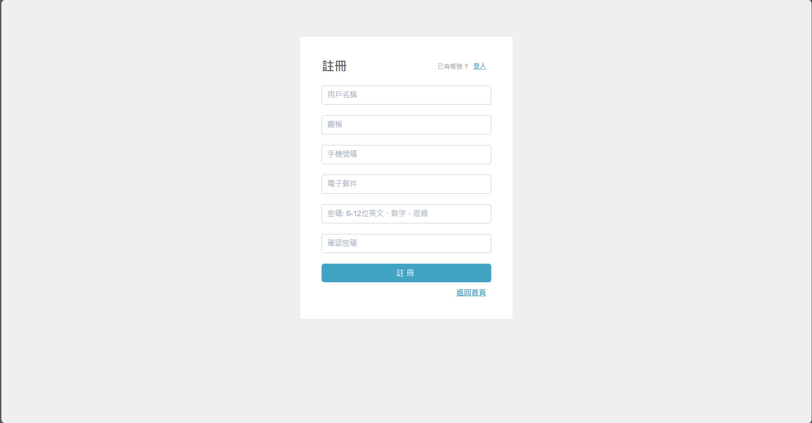
  <br><br>
  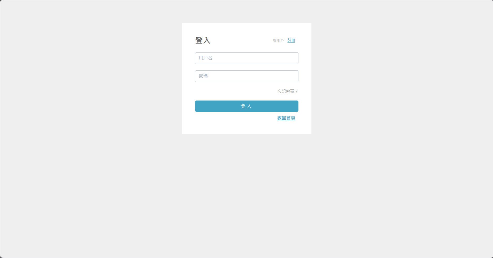
  <br><br>
  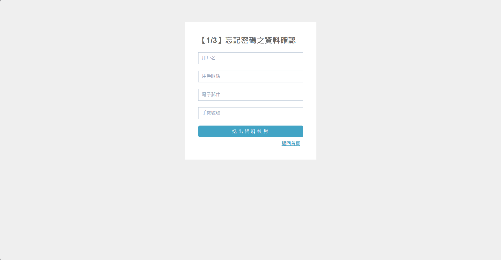
  <br><br>
  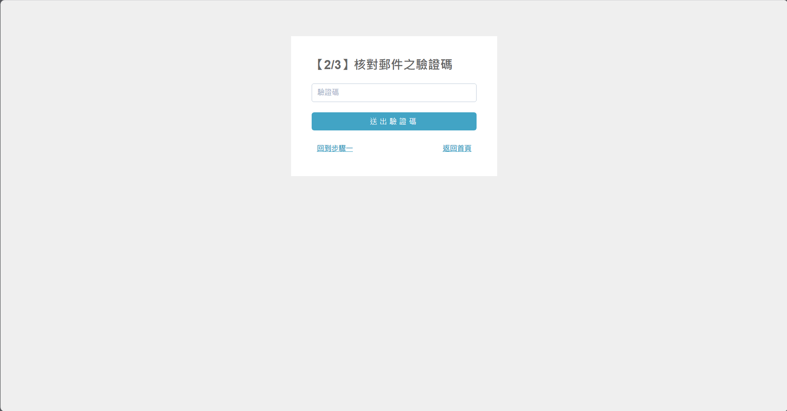
  <br><br>
  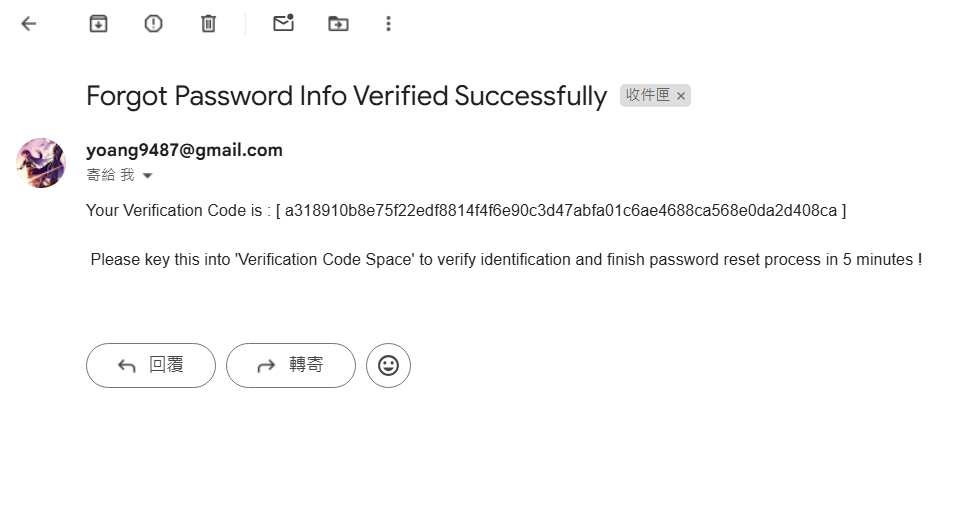
  <br><br>
  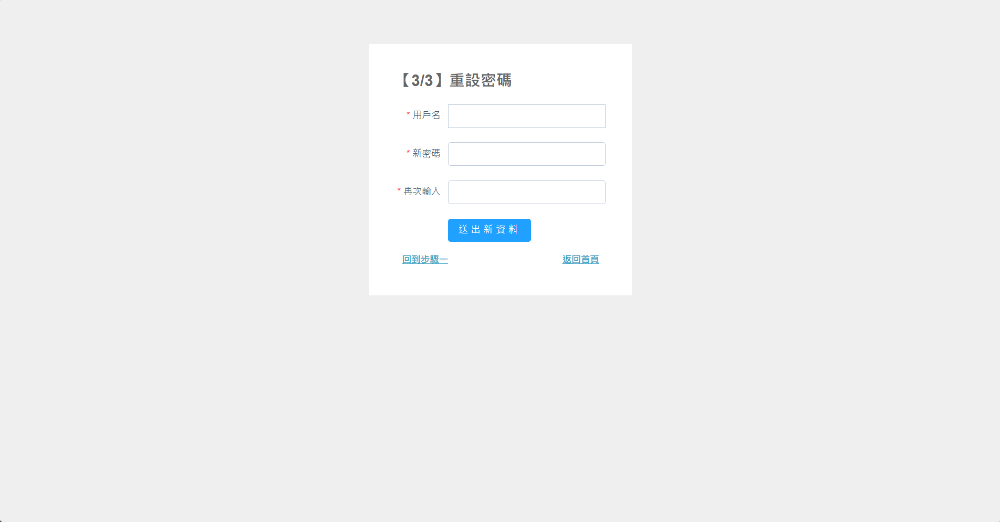

### 後台 :
- 參考 element-admin 排版設計
  <br><br>
  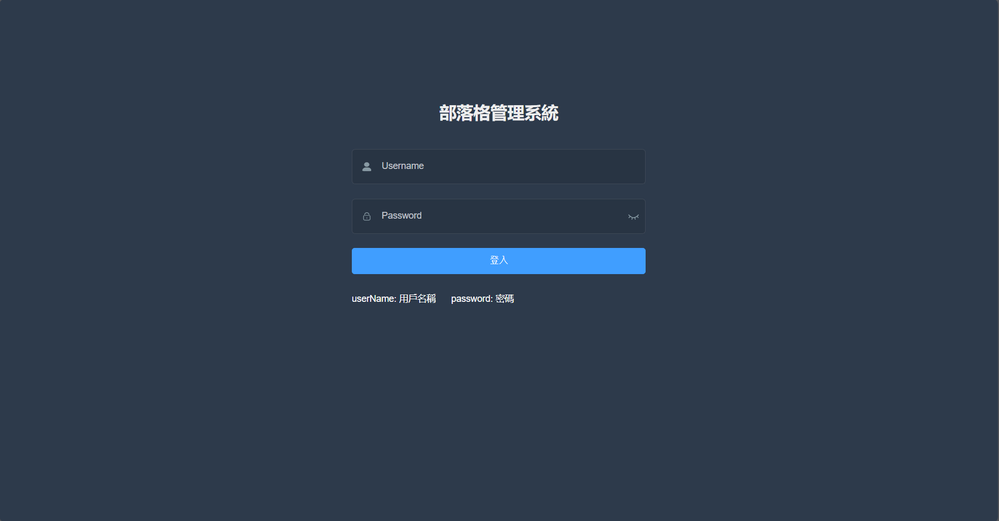
  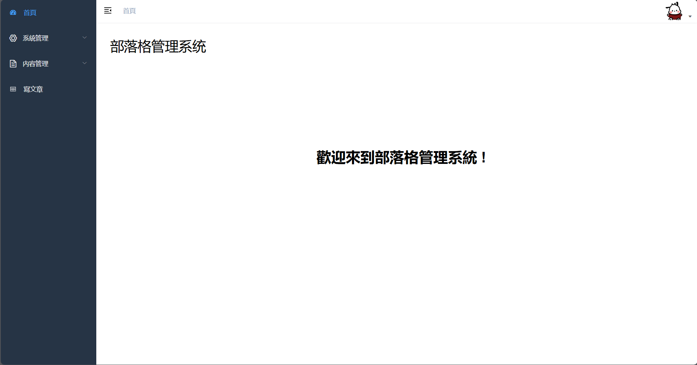<br><br>
- 後台人員操作採 RBAC 設計
  <br><br>
- 透過資料庫中權限欄位, 達成動態角色權限修改 與 動態菜單顯示, 便捷管理後台操作者
  <br><br>
  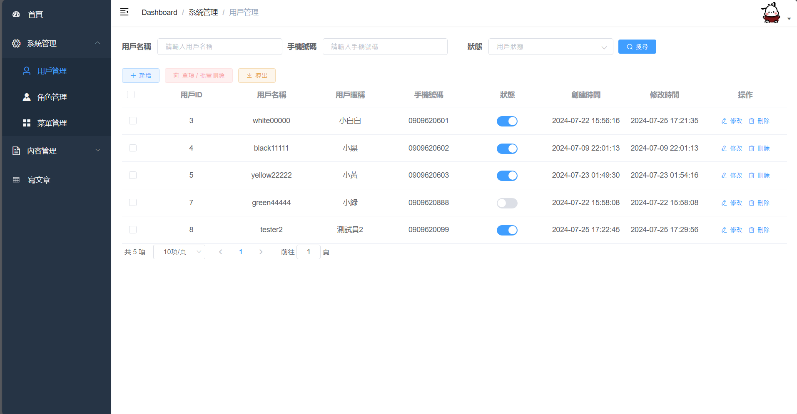
  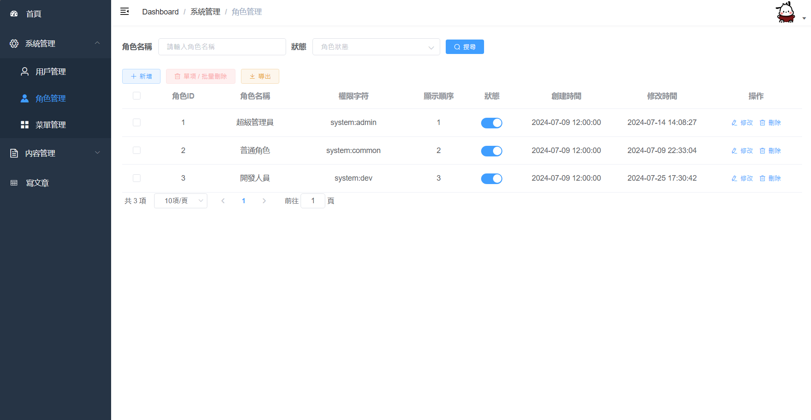
  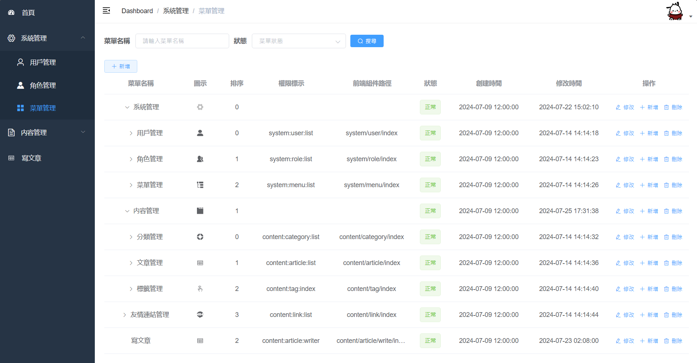
  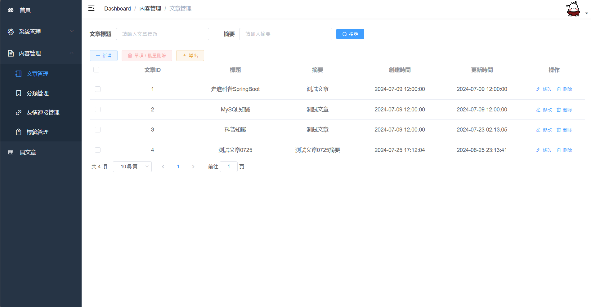
  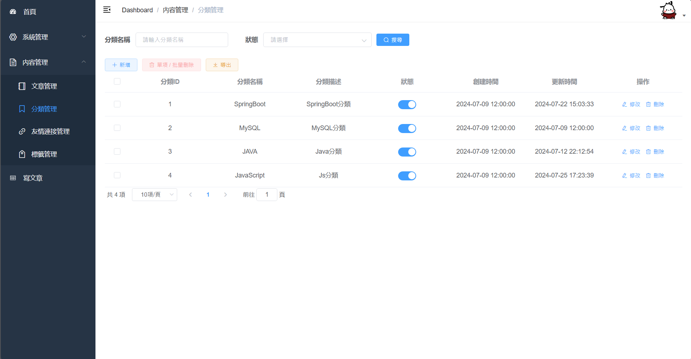
  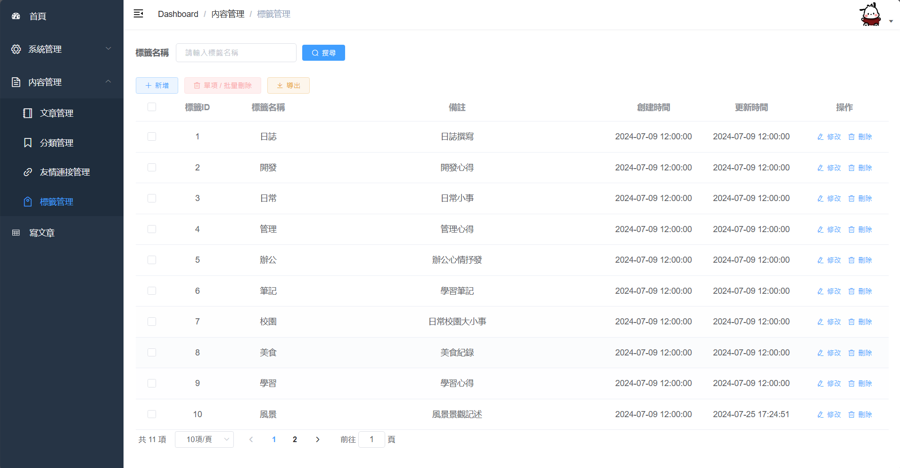<br><br>
- 審核友情連結 ( 交換連結 )
  <br><br>
  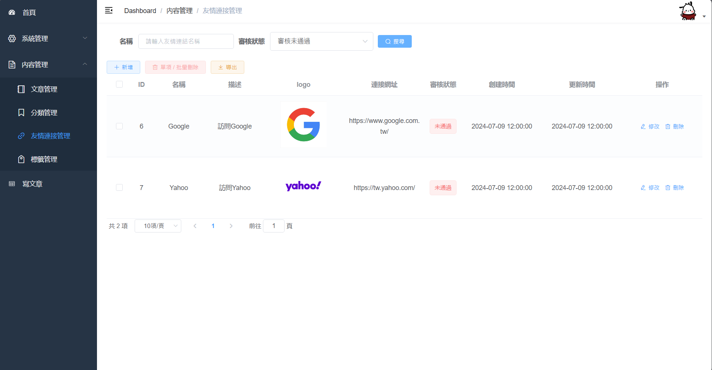<br><br>
- 文章可儲存為草稿形式
  <br><br>
- 採用 Markdown 文章編輯器
  <br><br>
  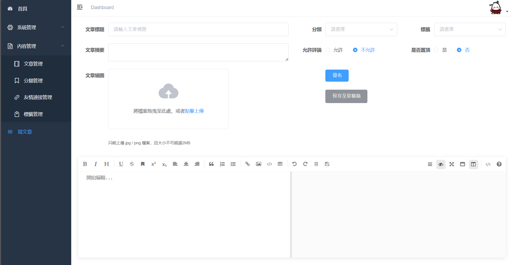<br><br>
- 整合 EasyExcel, 導出後台資料

## 使用技術介紹 :

### 前端技術 :

| 前端技術                 | 說明                |
| :--------------------: | :-------------------: |
| Vue2           | 核心前端開發框架      |
| Vue Router           | 路由框架      |
| Axios           | HTTP 框架      |
| Element UI           | UI 框架      |
| Mavon Editor           | 基於 Vue 的 Markdown 編輯器      |
| JS-Cookie           | Cookie 管理工具      |

### 後端技術 :

| 後端技術                 | 說明                |
| :--------------------: | :-------------------: |
| SpringBoot           | Web 應用程式開發框架      |
| Spring Security       | 授權與認證框架      |
| Spring Data JPA              | 數據持久層操作框架             |
| MySQL       | 關聯式資料庫管理系統      |
| Jakarta Mail       | 郵件接收與發送      |
| JJWT       | 支持 Java Web Token 登入      |
| Spring Validation       | 參數驗證框架      |
| Lombok       | 語言增強函式庫      |
| Easy Excel       | 基於 Java 的高效 Excel 讀寫處理工具      |
| Redis       | In-Memory 鍵值對資料結構存放      |
| MinIO       | 對象儲存      |
| Swagger       | 生成描述 RESTful API 的文檔      |
| Nginx       | 網頁伺服器 擔任傳遞前後端訊息的角色      |
| Docker       | 應用程式容器化      |

## 開發環境 :

| 開發工具 | 工具說明 |
|:-----------------------:|:--------------------:|
| IntelliJ IDEA | JAVA, SpringBoot 開發工具 IDE |
| VSCode | Vue 開發工具 IDE |
| Redis Desktop Manager | Redis緩存 可視化管理工具 |
| MySQL Workbench | 資料庫可視化設計及管理工具 |
| Docker Desktop | Docker 的圖形介面管理工具 |
| Postman | API測試工具 |
| JMeter | 請求壓力與效能測試工具 | 

| 應用與服務相關環境 | 版本 |
|:-------------:|:------:|
| OpenJDK &nbsp; 開發環境 | 17 |
| SpringBoot &nbsp; 開發框架 | 3.2.6 |
| MySQL &nbsp; 資料庫 | 8.0.19 |
| Redis &nbsp; 緩存觀看數與資料認證標示 | 6.0.8 |
| Nginx &nbsp; 反向代理 | 1.18.0 |
| MinIO &nbsp; 雲端對象儲存服務 | 8.5.10 |
| SpringDOC &nbsp; 接口描述文檔 | 2.0.3 |
| Easy Excel &nbsp; 導出後台資料Excel | 3.3.3 |
| Jakarta Mail &nbsp; 寄送驗證碼確認信 | 2.0.1 |

## 目錄結構 :

```
AkiBlogProject
├── aki-blog-frontend          -- 前端服務
│   ├── aki-blog-vue           -- 前台 (部落格文章頁面顯示)
│   └── aki-vue-admin          -- 後台 (後台管理系統CMS)
├── aki-blog-parent            -- 後端服務
│   ├── aki-blog               -- 前台後端服務
│   │   ├── config             -- 組件配置
│   │   ├── controller         -- 控制器
│   │   ├── filter             -- 認證Token過濾器
│   │   ├── job                -- 定時任務 (刷新文章viewCount)
│   │   └── runner             -- 應用啟動預載入 (載入文章viewCount)
│   ├── aki-admin              -- 後台後端服務
│   │   ├── config             -- 組件配置
│   │   ├── controller         -- 控制器
│   │   └── filter             -- 認證Token過濾器
│   └── aki-framework-common   -- 前後台通用組件
│       ├── annotation         -- 自定義註解 (打印指定事務資訊)
│       ├── aspect             -- 切面AOP模組
│       ├── config             -- 組件配置
│       ├── connectionTest     -- 連接測試 (Redis)
│       ├── constant           -- 常量定義
│       ├── converter          -- 轉換器
│       ├── customEnum         -- 自定義響應資訊枚舉
│       ├── domain             -- 對象域
│       │   ├── dto            -- 資料傳輸對象類
│       │   ├── entity         -- 實體對象類
│       │   ├── vo             -- 視圖對象類
│       │   ├── LoginUser      -- 用戶詳情對象類
│       │   └── ResponseResult -- 自定義響應對象類
│       ├── exception          -- 例外處理
│       ├── generator          -- 生成器
│       ├── handler            -- 處理器 (訪問拒絕處理器 + 身分驗證處理器)
│       ├── interceptor        -- 請求攔截器
│       ├── repository         -- 資料庫映射模組
│       ├── service            -- 服務模組
│       └── util               -- 工具類
└── deploy                     -- 部署資料 (volume指定之本地目錄)
    ├── minio                  -- 對象儲存服務Minio Data
    ├── mysql                  -- 資料庫與配置
    ├── nginx                  -- 反向代理配置與LOG
    └── redis                  -- Redis配置與儲存資料
```

## 安裝啟動與部署 :

**測試帳號：** white00000，**密碼**：00000

### 一、本地啟動 :

1. 確保已安裝所需依賴以及環境
   - JDK 17
   - MySQL 8.0.19
   - Redis 6.0.8
   - Nginx 1.18.0
   - MinIO 客戶端 8.5.10
2. 將 `mybolgSite.sql` 文件中的資料導入至本地資料庫中
3. 確保 `aki-blog-parent\aki-admin\` 與 `aki-blog-parent\aki-blog\` 目錄下的 `dev.env` 環境參數 ( 連接URL ) 正確
4. 將 `aki-blog-parent\aki-blog\` 目錄下的 `dev.env` 中 寄送方Eamil的資訊填妥, 密碼為應用程式密碼
5. 啟動本地 MySQL, Redis 服務 和 MinIO 客戶端
6. 確保 Node 版本為 v14.21.3, 及確保 Npm 版本為 6.14.18
7. 在 IntelliJ IDEA 中運行 `aki-blog-parent` 之 `aki-admin` 與 `aki-blog` APPLICATION
8. 在 VSCode 中運行 `aki-blog-frontend` 之 `aki-blog-vue` (前台) 與 `aki-vue-admin` (後台) APPLICATION
```
# Install dependencies 安裝所需依賴項
npm install

# Serve with hot reloading 啟動熱重載
npm run dev
```
9. 訪問 `http://localhost:8093` 查看前台, `http://localhost:8094` 查看後台
   
### 二、Docker Compose 部署 :

1. 確保已安裝並啟動 Docker Desktop
2. 將 `aki-blog-parent` 目錄下的 `.env` 中 寄送方Eamil的資訊填妥, 密碼為應用程式密碼
3. 在 `aki-blog-parent` 目錄下, 透過 terminal 執行 `docker-compose build` 建構, 然後再執行 `docker-compose up -d` 運行
4. 等待所有服務啟動完成
5. 訪問 `http://localhost:8093` 查看前台, `http://localhost:8094` 查看後台

### 為什麼選擇使用 Docker Compose ? 

1. **簡單易用** : Docker Compose 使用 YAML 文件來定義與管理多個應用容器, 簡化配置和部署過程
2. **擴展性強** : 可以輕鬆添加或移除任一服務, 且支持多個環境（開發、測試、生產環境）的配置

## 技術選型原因 :

1. **前後端分離**: 為了更好地管理與部署, 選擇前後端分離的架構。前端專注於資料展示和API交互, 後端專注於業務邏輯和資料處理

2. **RESTful API 設計**: 為了規範接口設計、提高可維護性, 因而採用 RESTful 風格設計 API。同時結合 Swagger 生成詳細的 API 文檔

3. **RBAC 權限管理**: 為了實現更細緻的權限控制, 選擇基於角色 (Role) 的訪問控制模型。可動態配置角色與權限, 來操作對應的菜單和按鈕

4. **Minio 對象儲存**: 可輕鬆管理文章縮圖和使用者頭貼等檔案外, 還是個可以處理影片、備份和容器鏡像的開源 OSS ( Object Storage Service )

## 可改良或擴增之處 :

- [ ] 整合 ElasticSearch 提高全文搜索效率
- [ ] 加入 OAuth2.0 登錄方式
- [ ] 改良程式碼結構, 提高效能與穩定性
